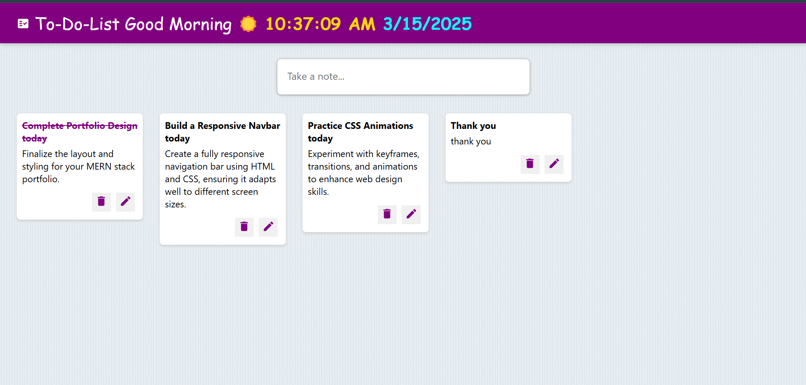

# 📝 To-Do List App  

A simple and interactive To-Do List application built using **React.js**. This app allows users to create, edit, and delete notes, with all data stored in **local storage** for persistence.  

## 🚀 Features  
✅ **Add Notes** – Users can create new notes with a title and content.  
✅ **Edit Notes** – Existing notes can be modified using the edit button.  
✅ **Delete Notes** – Users can remove notes when they are no longer needed.  
✅ **Persistent Storage** – Notes are saved in `localStorage`, so they remain even after a page refresh.  
✅ **Real-Time Clock** – A clock in the header dynamically updates every second.  

## 🛠️ Technologies Used  
- **React.js** (Functional Components & Hooks)  
- **Material UI Icons** (For better UI/UX)  
- **CSS** (Responsive styling)  
- **Local Storage** (For storing notes)  

## 📂 Project Structure  
```
ToDoList/
│── src/
│   ├── components/
│   │   ├── App.jsx
│   │   ├── Header.jsx
│   │   ├── Footer.jsx
│   │   ├── Note.jsx
│   │   ├── CreateArea.jsx
│   ├── index.js
│   ├── styles.css
│── public/
│── package.json
│── README.md
```

## ⚙️ Installation & Setup  
1. Clone the repository:  
   ```sh
   git clone https://github.com/MALLIKHARJUNCHILUKURI-02/to_do_list_react.git
   cd ToDoList
   ```
2. Install dependencies:  
   ```sh
   npm install
   ```
3. Start the development server:  
   ```sh
   npm start
   ```
4. Open your browser and visit:  
   ```
   http://localhost:3000
   ```

## 🖼️ Screenshots  
> Add some screenshots here to showcase your app.


## 🔮 Future Enhancements  
🚀 Add user authentication to sync notes across devices.  
🚀 Implement categories or tags for better organization.  
🚀 Introduce dark mode for a better user experience.  

## 🤝 Contributing  
Feel free to fork this repository and submit pull requests. Contributions are always welcome!  

---

Enjoy using the **To-Do List App**! 🚀